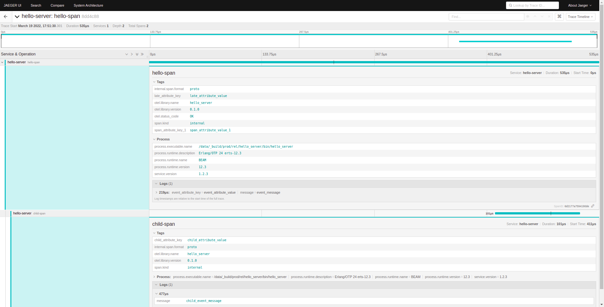

# OpenTelemetry Erlang example

## Steps to run the sample:
1. Start the app, otel-collector and Jaeger using [docker compose](https://docs.docker.com/compose/install/).
```shell
docker-compose up
```   

Once the they are running, Jaeger UI should be accessible at: http://localhost:16686/  

And the erlang hello server at: http://localhost:8080/  

2. Vizualise the traces:  
In the [Jaeger UI](http://localhost:16686/), for every request you sent you will get a single trace with 2 spans like this one:
